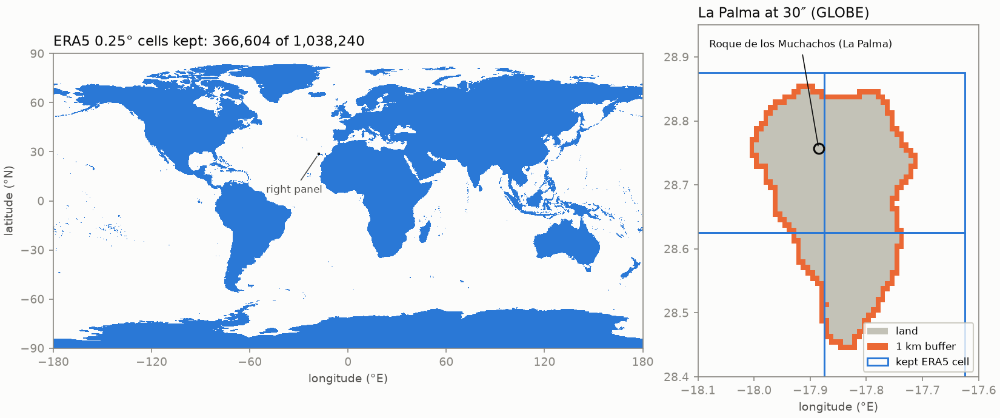

# Land mask: GLOBE land plus a 1 km buffer (phase 1 task 7)

- **Date:** 2026-09-27. **Code:** `src/astroseeing/terrain/landmask.py`, `astro build-landmask`, `configs/landmask.yaml`.
- **Stores** (written atomically at commit `a2e97dc`, verified bit-for-bit before and after rename):
  - `/data/astro/static/landmask/era5_0p25_cells_v1.zarr` (364 KB): per ERA5 0.25° cell, the number of GLOBE land cells, land-or-buffer cells and total cells, and `keep`.
  - `/data/astro/static/landmask/globe_30s_land_buffer_v1.zarr` (2.8 MB): `land` and `land_or_buffer` on the 21,600 × 43,200 GLOBE grid, for rendering.
- **Numbers:** `reports/landmask_summary.json`. **Figure:** `reports/figures/landmask_overview.png` (`scripts/plot_landmask.py`).
- **Build:** 31 s, 5.7 GB peak memory.

## What it is

- **Land:** NOAA GLOBE v1.0 as packed by `global-land-mask` 1.0.0 (MIT; source approved in D20). The package uses GLOBE's unrestricted "G.O.O.D." tiles (`*10g`) and GLOBE's ocean flag (−500) as sea. Lakes count as land; floating ice shelves count as sea.
- **Grid registration, checked against NOAA:** GLOBE's tile header (`a10g.hdr`, fetched from NOAA NCEI) gives the upper-left cell *centre* as 89.995833° N, 179.995833° W, with 1/120° cells. The package's `lat`/`lon` axes are therefore the cells' north and west *edges*, and its truncating lookup returns the cell containing a point. `load_globe_land()` checks these axes before using the array, and a hypothesis test checks our array against the package's `is_land` at random points.
- **Buffer (D22):** a 30″ cell is in the buffer if its centre is within 1 km of the nearest point of a land cell. Distances are great-circle on a sphere of the WGS84 mean radius (2a + b)/3. Rows two apart are at least 1.85 km apart, so only the rows above and below matter. Along a row, the reach grows with latitude: 1 cell at the equator, 2 at 60°, 6 at 80°, and whole rows next to the poles.
- **ERA5 cells:** 721 × 1440 points (90° to −90°, 0° to 359.75° E). Each cell is the ±0.125° box around its point, clipped at the poles. Its edges fall exactly on GLOBE cell edges, so a cell holds 30 × 30 GLOBE cells (15 × 30 at the poles). A cell is kept if it holds at least one land-or-buffer cell.

## Numbers, and how they compare with the estimates

| Quantity | This build | Earlier figure | Note |
|---|---|---|---|
| GLOBE land, share of Earth's area | 28.905% | 28.905% (D20) | same |
| Land + buffer, share of Earth's area | 29.131% | 29.19% (RESEARCH §8, *[estimate]*) | method of the estimate not recorded |
| ERA5 cells with land | 365,100 | 365,088 (D20) | 12 cells (0.003%) apart; see below |
| ERA5 cells kept (land + buffer) | **366,604** (35.31%) | 367,051 (RESEARCH §8) | −447 (−0.12%) |
| … of which kept only because of the buffer | 1,504 | 1,963 | |
| … south of 60° S | 99,904 (27.3%) | 27.9% | |
| Cells kept at 0.5° / 1° | 95,715 / 25,742 | 95,798 / 25,761 | |

**The 12-cell difference.** The cloud session didn't record how it counted, so I tried two plausible alternatives. Edge-aligned 0.25° boxes (a plain `reshape`) give 364,408. Assigning GLOBE cells by their north-west corner with round-half-to-even gives 365,113. Neither gives 365,088. Our definition is documented and tested, and the difference is immaterial.

**Buffer definition (D22, agent, provisional).** Two definitions were built and compared:

| Buffer measure | Land + buffer | Cells kept | Reach at the equator |
|---|---|---|---|
| Centre to centre | 29.066% | 366,305 | 4 neighbours (diagonals are 1.31 km away) |
| **Centre to the nearest point of a land cell** (chosen) | **29.131%** | **366,604** | 8 neighbours |

The second is "within 1 km of land" taken literally, with land cells treated as areas. The two differ by 299 cells (0.08%). Neither reproduces the research estimate (29.19%), whose method isn't recorded.

## Checks

- **Sites:** every validation site in `configs/sites.yaml` is on GLOBE land and in a kept cell, **except Bi et al.'s Rongcheng radiosonde site**. As listed in RESEARCH §6.1 (122.11° E, 36.46° N) it is in the Yellow Sea, 34.6 km from the nearest GLOBE land; Bi et al.'s ERA5 point for it (122.00° E, 36.50° N) is 36.0 km from land. Rongcheng is on the Shandong coast (at 37.46° N the point would be on land near Weihai). This has to be checked against the Bi et al. PDF, which I can't download (MDPI blocks non-browser clients). It doesn't affect the mask: validation boxes are stored whole, without the land mask.
- **Islands and edge cases:** Tristan da Cunha, Easter Island and Lord Howe Island are kept (their cells hold 122, 94 and 27 land cells). Dome C and the South Pole are kept. Open Pacific (0°, 140° W) and the middle of the Ross Ice Shelf (81.5° S, 175° W) are not.
- **Tests (14 in `tests/test_landmask.py`, 4 of them slow; plus 2 CLI tests in `tests/test_cli.py`):**
  - the buffer against a brute-force distance search on a 10° globe for both measures, with buffers up to 3 rows, wrap-around in longitude, and reach across the poles;
  - the reach is tight (≤ 1 km, and one more column would exceed it) on randomly sampled rows of the 30″ grid;
  - ERA5 cell edges fall exactly on the expected GLOBE rows and columns, including 0°/360° and the antimeridian;
  - golden counts on the real mask (365,100 and 366,604) and the package file's SHA-256;
  - sites and islands.

## What's uncertain

- **GLOBE's coastline** comes from 1990s sources (Digital Chart of the World and others). GLOBE says islands under about 1 km² may be missing. The buffer covers small offsets, not missing islands.
- **Ice shelves count as sea.** If Riley wants them (e.g. Ross or Ronne, which are observable ice surfaces), they need another source.
- **"Nearest point of a cell"** clamps latitude and longitude to the cell's edges. That's exact for 1 km anywhere except within about 1 km of a pole, where the rows are all land (Antarctica) or all sea (Arctic).
- **Not wired into the ingest yet.** `era5_cell_mask()` provides the `cells`-layout mask for phases 2 and 3. Phase 1 validation boxes are stored whole (D18).
